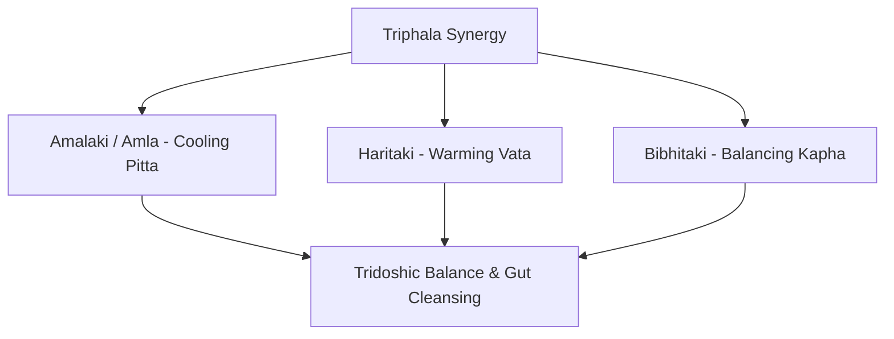

# Triphala (The Three Fruits) — Master Botanical Profile & Synergistic Synergy

Triphala (त्रिफला) is the most famous classical formula in Ayurvedic medicine. Meaning *"Three Fruits"*, it is a balanced equal combination of three powerhouse botanical fruits:
1. **[Amalaki (Amla)](/articles/amalaki_herb_profile)** (*Phyllanthus emblica*) — Pacifies **Pitta**
2. **[Haritaki](/articles/haritaki_herb_profile)** (*Terminalia chebula*) — Pacifies **Vata**
3. **[Bibhitaki](/articles/bibhitaki_herb_profile)** (*Terminalia bellirica*) — Pacifies **Kapha**

Together, these three fruits create a **Tridoshic Rasayana** that cleanses the entire gastrointestinal tract without causing dependency or dehydration.

---

## 🌿 1. Individual Botanical Constituents

| Fruit Name | Scientific Name | Primary Rasa (Taste) | Primary Dosha Action | Individual Profile |
| :--- | :--- | :--- | :--- | :--- |
| **Amalaki (Amla)** | *Phyllanthus emblica* | Sour, Sweet, Bitter | **Pitta Shamak** (Cooling) | [Read Amalaki Profile](/articles/amalaki_herb_profile) |
| **Haritaki** | *Terminalia chebula* | Astringent, Sweet | **Vata Shamak** (Warming) | [Read Haritaki Profile](/articles/haritaki_herb_profile) |
| **Bibhitaki** | *Terminalia bellirica* | Astringent, Bitter | **Kapha Shamak** (Drying) | [Read Bibhitaki Profile](/articles/bibhitaki_herb_profile) |

---

## ⚖️ 2. Ayurvedic Energy Profile (Taseer & Dravyaguna)

- **Rasa (Taste):** Contains 5 of the 6 Ayurvedic tastes (Sweet, Sour, Bitter, Pungent, Astringent) — lacking only Salt (*Lavana*).
- **Guna (Qualities):** *Laghu* (Light), *Ruksha* (Dry)
- **Virya (Taseer / Potency):** **Anushnasheetal (Equilibrated / Perfectly Neutral Taseer)**.
- **Vipaka (Post-Digestive Effect):** *Madhura* (Sweet).
- **Dosha Karma:** Completely balances Vata, Pitta, and Kapha.

---

## 🧪 3. Phytochemical & Health Benefits

- **Gallic Acid, Ellagic Acid & Chebulinic Acid:** Powerful antioxidant polyphenols that protect intestinal villi.
- **Natural Vitamin C Complex:** Bioavailable ascorbate bound to tannins for maximum stability.
- **Peristaltic Stimulation:** Tones intestinal smooth muscle, facilitating regular bowel movements.

---

## 💊 4. Dosage & Administration

- **Triphala Churna (Powder):** 3g – 6g taken at bedtime with warm water for gentle overnight colon detox.
- **Triphala Kwath (Decoction):** Used as an eye wash or oral rinse for gingivitis.

---

## 🔗 Deep-Dive Individual Profiles
- Read the individual [Amalaki (Amla) Profile](/articles/amalaki_herb_profile).
- Read the individual [Haritaki Profile](/articles/haritaki_herb_profile).
- Read the individual [Bibhitaki Profile](/articles/bibhitaki_herb_profile).
