# Architecture — ayurshakti.shop

**Generated:** 2026-07-12 | **Source:** Manual codebase analysis

---

## System Overview

AyurShakti is an Ayurveda and pet health content website hosted on **Google Blogger** with a custom domain at `ayurshakti.shop`. The system uses a **layered automation architecture** designed for a single-operator AI-agent model:

- **Content Layer:** Google Blogger CMS (custom theme XML) behind Cloudflare CDN
- **Automation Layer:** Python scripts for scheduling, publishing, social syndication, SEO monitoring
- **State Layer:** JSON-based tracking files (no SQL database) for queues, registries, API usage
- **Integration Layer:** Google Cloud APIs (Blogger, GA4, Search Console, Indexing), social platforms, Cloudflare edge services
- **Email Layer:** Google Sheets + Apps Script for subscriber management and newsletters

```
┌──────────────────────────────────────────────────────────────────────────────────┐
│                           END USERS & AI CRAWLERS                                │
│                    Browser | GPTBot | ClaudeBot | Perplexity                     │
└────────────────────────────┬─────────────────────────────────────────────────────┘
                             │ HTTPS
┌────────────────────────────▼─────────────────────────────────────────────────────┐
│                         CLOUDFLARE CDN + EDGE                                     │
│       ┌──────────────────────┬───────────────────────┬──────────────────────┐     │
│       │  DNS + SSL + Cache   │  Workers (llms.txt)   │  Pages (assets)      │     │
│       └──────────┬───────────┴───────────────────────┴──────────────────────┘     │
│                  │                                                               │
│       ┌──────────▼───────────┐                                                   │
│       │  GOOGLE BLOGGER CMS  │                                                   │
│       │   ayurshakti-main.xml│                                                   │
│       │   Blog posts + Pages │                                                   │
│       └──────────────────────┘                                                   │
└──────────────────────────────────────────────────────────────────────────────────┘
                             │
┌────────────────────────────▼─────────────────────────────────────────────────────┐
│                     PYTHON AUTOMATION SCRIPTS                                    │
│  ┌──────────────┐  ┌────────────┐  ┌───────────┐  ┌──────────────┐              │
│  │ Auto-Scheduler│  │Social Poster│  │ IndexNow   │  │ Ping Notifier│              │
│  │ schedule-    │  │social-post │  │ bing-      │  │ notify-ping  │              │
│  │ posts.py     │  │.py         │  │ sitemap-   │  │ .py          │              │
│  └──────┬───────┘  └─────┬──────┘  └─────┬─────┘  └──────┬───────┘              │
│         │                │               │               │                       │
│  ┌──────▼────────────────▼───────────────▼───────────────▼───────┐              │
│  │                    lib/ (shared auth, profile, tracking)       │              │
│  │  auth.py  |  profile.py  |  utils.py  |  tracking.py          │              │
│  └───────────────────────────────────────────────────────────────┘              │
└──────────────────────────────────────────────────────────────────────────────────┘
                             │
┌────────────────────────────▼─────────────────────────────────────────────────────┐
│                     JSON STATE FILES (data/tracking/)                            │
│  ┌──────────────┐  ┌──────────────┐  ┌──────────────┐  ┌──────────────┐        │
│  │ article-     │  │ api-usage-   │  │ pipeline-    │  │ analytics-   │        │
│  │ registry.json│  │ log.json     │  │ status.json  │  │ history.json │        │
│  └──────────────┘  └──────────────┘  └──────────────┘  └──────────────┘        │
└──────────────────────────────────────────────────────────────────────────────────┘
                             │
┌────────────────────────────▼─────────────────────────────────────────────────────┐
│                     EXTERNAL INTEGRATIONS                                        │
│  ┌──────────┐ ┌──────────┐ ┌────────┐ ┌─────────┐ ┌─────────┐ ┌──────────┐    │
│  │ Blogger   │ │ GA4/     │ │ Search │ │ Social  │ │ Email   │ │ PubMed   │    │
│  │ API v3    │ │ GSC APIs │ │ Engines│ │ APIs    │ │ Apps    │ │ Citation │    │
│  └──────────┘ └──────────┘ └────────┘ └─────────┘ └─────────┘ └──────────┘    │
└──────────────────────────────────────────────────────────────────────────────────┘
```

---

## Functional Areas

### 1. Content Management (Blogger CMS)

| Component | Technology | Purpose |
|-----------|-----------|---------|
| Blogger CMS | Google Blogger v3 | Hosting all blog posts and static pages |
| Theme XML | Custom Bhati UI v0.2 (6000+ lines) | Site presentation, SEO meta tags, responsive layout, dark mode |
| Blog Posts | 11 published articles + drafts | Ayurveda health and pet wellness content |
| Legal Pages | 5 static Blogger pages | About Us, Contact, Medical Disclaimer, Terms, Privacy Policy |

**Key Files:**
- `theme-and-logo/ayurshakti-main.xml` — Full Blogger theme with GA4 gtag, dark mode, service worker, SEO metadata
- `scripts/approval-queue.json` — Articles pending scheduling
- `scripts/agent-pending-posts.json` — Social posts pending browser agent

### 2. Python Automation Scripts

The automation layer has **15 Python scripts** organized around the content lifecycle:

#### Core Pipeline (Executed by Scheduler)
| Script | Lines | Responsibility |
|--------|-------|---------------|
| `schedule-posts.py` | 364 | Main orchestrator — picks 2 approved articles, schedules via Blogger API, chains syndication |
| `social-post.py` | 270 | Cross-platform posting (Bluesky API, X/Twitter OAuth 1.0a, Pinterest API v5) |
| `bing-sitemap-submit.py` | 54 | IndexNow protocol submission to Bing, Yandex, Seznam |
| `notify-ping.py` | 89 | XML-RPC pings to 15+ search engines and blog aggregators |
| `analytics-report.py` | 190 | GA4 + Search Console traffic reporting (post-publish snapshot) |

#### Maintenance & Fixes
| Script | Lines | Responsibility |
|--------|-------|---------------|
| `update_images_blogger.py` | 125 | Migrate image URLs from Blogger to Cloudflare CDN |
| `update_img_paths.py` | 82 | Regex-based image path migration to `/img/` subdirectory |
| `fix_post.py` | 91 | Fix HTML formatting issues in published posts |
| `check_live_images.py` | 21 | Verify live images on published posts |
| `fetch_post_temp.py` | 33 | Fetch single post by path for debugging |
| `assign_categories.py` | 83 | Assign category labels via Blogger PATCH API (root-level) |

#### Research & Monitoring
| Script | Lines | Responsibility |
|--------|-------|---------------|
| `pubmed-cite.py` | 83 | Fetch PubMed citations for evidence-based content |
| `monitor-mentions.py` | 162 | Weekly brand mention tracking via DuckDuckGo HTML search |
| `track_topics.py` | 70 | Extract topics from research docs into article registry |

#### Shared Library (`scripts/lib/`)

| Module | Purpose |
|--------|---------|
| `profile.py` | Centralized config — loads `config/profile.json` for site/author/brand/scripts paths |
| `auth.py` | Blogger OAuth 2.0 token refresh + Google Service Account JWT token generation |
| `utils.py` | Logger with rotation, EST timezone, config loading, dry-run, subprocess runner |
| `tracking.py` | JSON state file CRUD with file locking, API usage tracking, article registry, pipeline status |
| `__init__.py` | Package marker |

### 3. Edge Services (Cloudflare)

| Service | Purpose | Implementation |
|---------|---------|---------------|
| **DNS** | `ayurshakti.shop` DNS resolution | Cloudflare DNS with proxied (orange-cloud) records |
| **CDN** | SSL termination, caching, DDoS protection | Cloudflare CDN |
| **Workers** | Serving `llms.txt` to AI crawlers | `scripts/llms-worker.js` — Python markdown converted to text |
| **Pages** | Static asset hosting (images, PDFs, keys) | Cloudflare Pages from `bhati8833/ayurshakti-images` repo |
| **Email Routing** | `contact@ayurshakti.shop` forwarding | Cloudflare Email → Gmail (`vle.bhati@gmail.com`) |
| **Workers (Future)** | `ads.txt` serving at root | `scripts/ads-worker.js` (pre-created, not deployed) |

**Two-Token Auth System:**
- **Token A** (Workers & Pages): Account-level, permissions for Workers:Edit, Pages:Edit, KV:Edit
- **Token B** (Zone Admin): Zone-level, permissions for DNS:Edit, Cache:Purge, SSL:Edit, WAF:Edit

### 4. Data & Tracking Layer

```
data/tracking/
├── article-registry.json    # Master article ledger (post IDs, titles, URLs, labels)
├── api-usage-log.json       # Per-service rate limit tracking (daily + monthly)
├── pipeline-status.json     # Pipeline stage tracking (scheduled→published→social→pinged)
├── analytics-history.json   # GA4 + GSC historical snapshots (last 90 reports)
├── analytics.log            # Analytics report run log
├── indexing-log.json        # Google Indexing API submission records
├── project-tasks.json       # AI agent task management
└── manual-image-requests.txt # Pending image generation requests
```

### 5. Email Marketing Layer

| Component | Technology | Purpose |
|-----------|-----------|---------|
| **Subscriber DB** | Google Sheets | `AyurShakti Email List` spreadsheet |
| **Apps Script** | Google Apps Script | Welcome emails, weekly newsletters, bounce handling |
| **Email Sending** | GmailApp API | Transactional emails (80/day max) |

**Triggers:**
- On form submit: send welcome email with lead magnet
- Weekly Tuesday 8am: send curated newsletter
- Daily 6am: bounce check and cleanup

### 6. External API Integrations

| API | Auth Method | Quota | Used In |
|-----|------------|-------|---------|
| **Blogger API v3** | OAuth 2.0 (write) + API Key (read) | 10k req/day | schedule-posts, fix_post, update_images, assign_categories |
| **GA4 Data API** | Service Account JWT | 200k req/day | analytics-report |
| **Search Console** | Service Account JWT | 2k queries/day | analytics-report |
| **Indexing API** | Service Account JWT | 200 URLs/day | docs (not yet integrated) |
| **PageSpeed Insights** | API Key | 25k req/day | docs reference |
| **Bluesky AT Protocol** | Password session | Unlisted | social-post |
| **X/Twitter API v2** | OAuth 1.0a | Unlisted | social-post |
| **Pinterest API v5** | OAuth 2.0 Bearer | Unlisted | social-post |
| **Bing IndexNow** | API Key | Unlisted | bing-sitemap-submit |
| **Seznam Webmaster** | API Key + Cookie | 5 req/s | seznam-api |

---

## Key Execution Flows

### Flow 1: Article Lifecycle (AI Agent → Published)

```
┌──────────┐   ┌──────────┐   ┌──────────┐   ┌──────────┐   ┌──────────┐
│  Topic    │──▶│ Article  │──▶│ Approval │──▶│ Scheduler│──▶│ Social   │
│  Research │   │ Writing  │   │ Queue    │   │ Posts.py │   │ Syndicate│
└──────────┘   └──────────┘   └──────────┘   └──────────┘   └──────────┘
                                                    │
                                                    ▼
                                           ┌─────────────────┐
                                           │  Post-Publish    │
                                           │  Chain           │
                                           │  ┌─────────────┐ │
                                           │  │ IndexNow    │ │
                                           │  │ Submit      │ │
                                           │  └─────────────┘ │
                                           │  ┌─────────────┐ │
                                           │  │ Ping 15+    │ │
                                           │  │ Engines     │ │
                                           │  └─────────────┘ │
                                           │  ┌─────────────┐ │
                                           │  │ Social Post │ │
                                           │  │ (Bluesky/X/ │ │
                                           │  │  Pinterest) │ │
                                           │  └─────────────┘ │
                                           │  ┌─────────────┐ │
                                           │  │ Analytics   │ │
                                           │  │ Snapshot    │ │
                                           │  └─────────────┘ │
                                           └─────────────────┘
```

**Steps:**
1. AI agent researches topic (per `docs/08-topic-research-rule.md`)
2. Agent writes article with PubMed citations (per `docs/09-article-writing-rule.md`)
3. Article added to `scripts/approval-queue.json` with status `pending`
4. `schedule-posts.py` runs via cron every 12h:
   - Reads queue, picks 2 articles from top
   - Calculates next EST schedule windows (morning 8-10am, evening 6-8pm)
   - Converts Markdown → HTML via `markdown` library
   - Calls Blogger API v3 `POST /blogs/{id}/posts/` to schedule
   - On success: IndexNow submit → Ping services → Social post → Analytics snapshot
5. Article published at scheduled time by Blogger

### Flow 2: Analytics Data Pipeline

```
┌──────────┐   ┌───────────────┐   ┌──────────┐   ┌───────────────┐
│  gtag.js  │──▶│  GA4 Property │──▶│ analytics│──▶│ Tracking      │
│  (theme)  │   │  #533609055   │   │ -report  │   │ History JSON  │
└──────────┘   └───────────────┘   │  .py     │   └───────────────┘
                                   └──────────┘
                                        │
                                        ▼
                               ┌────────────────┐
                               │  Terminal      │
                               │  Report (CLI)  │
                               └────────────────┘
```

**Steps:**
1. gtag.js in Blogger theme collects pageviews (established frontend tracking)
2. Service account JWT generates bearer token via OAuth 2.0 token exchange
3. `analytics-report.py` calls GA4 Data API + Search Console API
4. Format results as terminal table or JSON
5. Save snapshot to `data/tracking/analytics-history.json`
6. Called automatically after each scheduler publish cycle

### Flow 3: Social Syndication Chain

```
                    ┌──────────────────┐
                    │  social-post.py  │
                    │  (called by      │
                    │   scheduler)     │
                    └────────┬─────────┘
                             │
              ┌──────────────┼──────────────┐
              ▼              ▼              ▼
     ┌──────────────┐ ┌────────────┐ ┌────────────┐
     │  Bluesky API │ │ X/Twitter  │ │ Pinterest  │
     │  AT Protocol │ │ OAuth 1.0a │ │ API v5     │
     │  createRecord│ │ HMAC-SHA1  │ │ OAuth 2.0  │
     └──────────────┘ └────────────┘ └────────────┘
              │              │              │
              ▼              ▼              ▼
     ┌──────────────────────────────────────────┐
     │  agent-pending-posts.json                │
     │  (LinkedIn + Medium queued for agent)    │
     └──────────────────────────────────────────┘
```

**Auth Methods Used:**
- Bluesky: Password → session cookie → createRecord
- X/Twitter: Custom `TwitterOAuth1` class (HMAC-SHA1 signature, 4 credentials: consumer key/secret, access token/secret)
- Pinterest: Bearer token from `secrets/pinterest-creds.json`
- LinkedIn/Medium: Queued to JSON file, posted manually by AI agent via browser

### Flow 4: Rate Limit Guard Pattern

Every script that makes external API calls follows this pattern:

```
     ┌─────────────────────────────────┐
     │  check_api_usage("service")     │
     │  reads api-usage-log.json       │
     └─────────────┬───────────────────┘
                   │
          ┌────────▼────────┐
          │  Within limit?   │
          └───┬────────┬────┘
         YES  │        │  NO
              ▼        ▼
     ┌────────────┐  ┌──────────────────────┐
     │  Make API  │  │  Log warning + skip  │
     │  Call      │  │  (abort operation)   │
     └─────┬──────┘  └──────────────────────┘
           │
           ▼
     ┌────────────┐
     │  increment │
     │  _api_usage│
     └────────────┘
```

---

## Data Flow Diagram

```mermaid
flowchart TB
    subgraph Presentation["Presentation Layer"]
        B[Blogger CMS]
        CF[Cloudflare CDN]
        CFW[Cloudflare Workers<br/>llms.txt]
        CFP[Cloudflare Pages<br/>resources.ayurshakti.shop]
    end

    subgraph Automation["Automation Layer<br/>Python Scripts"]
        SCH[schedule-posts.py<br/>Auto Scheduler]
        SOC[social-post.py<br/>Social Poster]
        IDX[bing-sitemap-submit.py<br/>IndexNow Submit]
        PNG[notify-ping.py<br/>Ping Services]
        ANL[analytics-report.py<br/>Analytics Reporter]
        LIB[lib/ auth, profile,<br/>utils, tracking]
    end

    subgraph State["State Layer<br/>JSON Files"]
        ART[article-registry.json]
        API[api-usage-log.json]
        PIP[pipeline-status.json]
        AH[analytics-history.json]
        APQ[approval-queue.json]
    end

    subgraph External["External APIs"]
        GA4[GA4 Data API]
        GSC[Search Console]
        BLU[Bluesky AT Protocol]
        X[X/Twitter API v2]
        PIN[Pinterest API v5]
        BING[Bing IndexNow]
        PUB[PubMed]
    end

    subgraph Email["Email Marketing"]
        GSH[Google Sheets<br/>Subscriber DB]
        GAS[Google Apps Script<br/>Welcome + Newsletter]
    end

    B --> CF
    CF -->|Browser| Users
    CFW -->|AI Crawlers| AICrawlers[GPTBot/Claude/Perplexity]

    SCH -->|Reads| APQ
    SCH -->|Writes| ART
    SCH -->|Writes| PIP
    SCH -->|Calls| B
    SCH -->|Triggers| IDX
    SCH -->|Triggers| PNG
    SCH -->|Triggers| SOC
    SCH -->|Triggers| ANL
    SCH -->|Tracks| API

    SOC -->|Posts to| BLU
    SOC -->|Posts to| X
    SOC -->|Posts to| PIN
    SOC -->|Queues to| APQ2[agent-pending-posts.json]

    ANL -->|Reads| GA4
    ANL -->|Reads| GSC
    ANL -->|Writes| AH

    IDX -->|Submits to| BING
    PNG -->|Pings| SEARCH[15+ Search Engines]

    GSH --> GAS
    GAS -->|Sends| EMAIL[Welcome/Newsletter]

    LIB -->|Auth for| SCH
    LIB -->|Auth for| SOC
    LIB -->|Auth for| ANL
    LIB -->|Profile for| ALL[All Scripts]
```



---

## Deployment Architecture

```
┌─────────────────────────────────────────────────────────────────────────┐
│                        DEPLOYMENT TOPOLOGY                              │
│                                                                         │
│   ┌─────────────────────┐    ┌────────────────────────────────────┐     │
│   │  GitHub Repo         │    │  Linux Server (Ubuntu 24.04)       │     │
│   │  bhati8833/          │    │  ┌──────────────────────────────┐  │     │
│   │  ayurshakti.shop     │────│  │  Python 3.12 Scripts         │  │     │
│   └─────────────────────┘    │  │  scripts/*.py                 │  │     │
│                              │  │  ├── schedule-posts.py        │  │     │
│   ┌─────────────────────┐    │  │  ├── social-post.py           │  │     │
│   │  GitHub Repo         │    │  │  ├── analytics-report.py     │  │     │
│   │  bhati8833/          │    │  │  └── ... (12 more)           │  │     │
│   │  ayurshakti-images   │    │  └──────────────────────────────┘  │     │
│   └─────────┬───────────┘    │                                       │     │
│             │                │  ┌──────────────────────────────┐  │     │
│             ▼                │  │  Cron (every 12h)            │  │     │
│   ┌─────────────────────┐    │  │  schedule-posts.py           │  │     │
│   │  Cloudflare Pages   │    │  └──────────────────────────────┘  │     │
│   │  resources.         │    │                                       │     │
│   │  ayurshakti.shop    │    │  ┌──────────────────────────────┐  │     │
│   └─────────────────────┘    │  │  data/tracking/              │  │     │
│                              │  │  JSON state files            │  │     │
│   ┌─────────────────────┐    │  └──────────────────────────────┘  │     │
│   │  Cloudflare Workers │    │                                       │     │
│   │  llms.ayurshakti.   │    │  ┌──────────────────────────────┐  │     │
│   │  shop               │    │  │  secrets/                    │  │     │
│   └─────────────────────┘    │  │  (git-ignored, local only)   │  │     │
│                              │  └──────────────────────────────┘  │     │
│   ┌─────────────────────┐    └────────────────────────────────────┘     │
│   │  Google Blogger      │                                             │
│   │  ayurshakti.shop     │    ┌────────────────────────────────────┐     │
│   └─────────────────────┘    │  Google Apps Script (cloud-hosted)   │     │
│                              │  email-apps-script-code.js           │     │
│   ┌─────────────────────┐    │  Attached to Google Sheets           │     │
│   │  Google Sheets       │    └────────────────────────────────────┘     │
│   │  Email Subscribers   │                                             │
│   └─────────────────────┘                                             │
└─────────────────────────────────────────────────────────────────────────┘
```

---

## Configuration & Secrets

| System | Config File | Purpose |
|--------|------------|---------|
| Project Profile | `config/profile.json` | Site name, URLs, author bio, brand voice, script paths |
| Scheduler Config | `scripts/schedule-config.json` | Schedule windows, timezone, max posts per run |
| OAuth Credentials | `secrets/blogger-oauth-tokens.json` | Blogger write access via refresh token |
| API Key | `secrets/blogger-api-key.txt` | Blogger read-only + PageSpeed API |
| Service Account | `secrets/ayurshakti-501603-a1a6ff0396df.json` | GCP JWT auth for GA4, GSC, Indexing |
| Social Creds | `secrets/x-creds.json`, `secrets/bluesky-creds.json`, `secrets/pinterest-creds.json` | Social platform auth |
| Cookies | `secrets/cookies-*.txt` | Browser session cookies (Reddit, Quora, Medium) |
| Cloudflare | `secrets/cloudflare-*-token.txt` | Workers (Token A) + Zone (Token B) |
| Bing | `secrets/bing-api-key.txt`, `secrets/bing-client-credentials.json` | IndexNow + Webmaster |
| Seznam | `secrets/seznam-api-key.txt` | Webmaster API |

---

## Security Boundaries

```
                    PUBLIC INTERNET
┌───────────────────────────────────────────────────────────────────┐
│  End Users (HTTPS)              AI Crawlers (llms.txt)            │
└────────────────────┬──────────────────────────────────────────────┘
                     │
                    ▼
┌───────────────────────────────────────────────────────────────────┐
│  CLOUDFLARE (WAF, DDoS, SSL)  ────  Blogger CMS                   │
│  • Proxied DNS hides origin IP                                    │
│  • Rate limiting on all endpoints                                 │
│  • WAF blocks SQLi, XSS, path traversal                           │
└───────────────────────────────────────────────────────────────────┘
                     │
                     │ API Calls
                    ▼
┌───────────────────────────────────────────────────────────────────┐
│  GOOGLE OAUTH 2.0 (All write operations)                          │
│  • OAuth refresh token (never in code, never committed)           │
│  • Service Account JWT (private key in gitignored secrets/)       │
│  • API Key (restricted to Blogger + PageSpeed only)               │
└───────────────────────────────────────────────────────────────────┘
                     │
                     │ Script Execution
                    ▼
┌───────────────────────────────────────────────────────────────────┐
│  LOCAL SERVER (Python scripts)                                    │
│  • Cron-based execution (no web-facing endpoints)                 │
│  • Dry-run mode for safe testing                                  │
│  • Rate limit guardrails prevent quota exhaustion                 │
│  • File-locked JSON state files prevent corruption                │
└───────────────────────────────────────────────────────────────────┘
```

---

## Key Architectural Decisions

| Decision | Rationale | Trade-off |
|----------|-----------|-----------|
| Blogger CMS (not WordPress) | Zero hosting cost, built-in CDN, simple API | Limited customization, no server-side processing |
| JSON-as-database | No server setup, git-trackable state, simple reads/writes | No query capability, no referential integrity, manual compaction |
| Python automation (not Node.js/bash) | OAuth 1.0a support (X/Twitter), cryptography lib, rich stdlib | Single-language dependency |
| Service Account for GCP APIs | No user presence required for automated analytics | JWT signing adds complexity vs API Key |
| Two Cloudflare tokens | Least-privilege principle — Workers token can't modify DNS | Token management overhead |
| Queue-based approval system | Human-in-the-loop prevents auto-publishing low-quality drafts | Requires manual approval step |
| Cron-based scheduling (not daemon) | Simple, predictable, easy to debug | No continuous monitoring, single point of failure |
